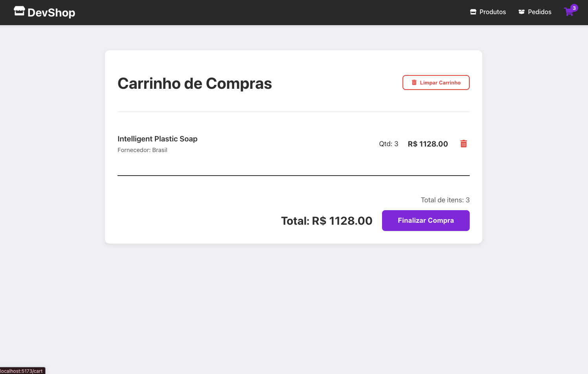

# Desafio E-commerce

Este repositório contém um projeto de e-commerce completo, dividido em duas partes principais: um backend em NestJS e um frontend em React.

## Visão Geral

O objetivo deste projeto é simular uma loja virtual que busca produtos de diferentes fornecedores e permite que os clientes façam pedidos.

- O **backend** é responsável por agregar os produtos, gerenciar os pedidos e fornecer uma API para o frontend.
- O **frontend** consome a API para exibir os produtos, permitir que o usuário monte um carrinho e finalize a compra.

Para instruções detalhadas sobre como executar cada parte do projeto, consulte os `README` específicos:

- **[Frontend](/frontend/README.md)**: Instruções para a interface do usuário em React.
- **[Backend](/backend/README.md)**: Instruções para a API em NestJS.

## Telas do Frontend

Aqui estão algumas das principais telas da aplicação:

### Página Inicial

### Detalhes do Produto

### Carrinho de Compras

### Carrinho Vazio

### Meus Pedidos

### Nenhum Pedido Encontrado

